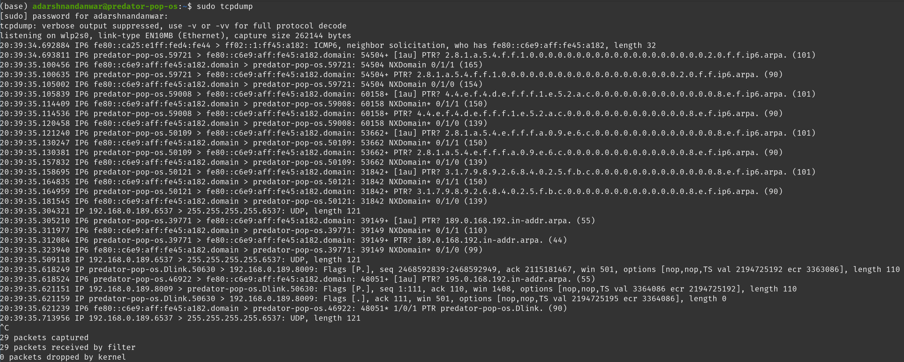

# Lab 1

Name- Adarsh Nandanwar 
BITS ID- 2018A7PS0396G

 
 

## tcpdump

- dumps traffic or TCP/IP packets on a network
- In the output line from left to right
    1. Timestamp
    2. protocol (e.g. IP)
    3. source hostname/IP along with the port number
    4. destination hostname/IP along with the port number
    5. TCP Flags. Theses are some combination of S (SYN), F (FIN), P (PUSH), R (RST), U (URG), W (ECN CWR), E (ECN-Echo) or '.' (ACK), or 'none' if no flags are set.
    6. Data sequence number. Data-seqno describes the portion of sequence space covered by the data in this packet
    7. Acknowledgement number. It is sequence number of the next data expected the other direction on this connection.
    8. Window size. This is number of bytes of receive buffer space available the other direction on this connection.
    9. TCP options
    10. Len or length of the data payload.

## ifconfig 

- Ifconfig  is used to configure the kernel-resident network interfaces.
- If no arguments are given, ifconfig displays the status of the currently active interfaces.
- In the screenshot, there are ethernet, loopback and wlan interfaces
- line 1 has flags (e.g. UP, BROADCAST, MULTICAST)
- inet adderess is the IPv4 address, inet6 is the IPv6 address of the interface. Similarly, subnet mask and broadcast address is also mentioned.
- In the end, some packet stats are mentioned
    - RX packets, errors, dropped - total number of packets received, recieved error and dropped respectively
    - TX packets, errors, dropped - total number of packets transmitted, recieved error and dropped respectively

## dig 

- `dig` is command for DNS lookup utility
- using query options (e.g. +nocomments), we can modify the output
- First, dig command's version number is printed in the header
- QUESTION SECTION displays our input
- ANSWER SECTION displays the response (A Record) to our query
- In the end, dig prints some stats like time taken, timestamp, etc

## arp 

- Arp  manipulates  or displays the kernel's IP network neighbour cache. It can add entries to the table, delete one or display the current content.
- The output is a table with the columns: IP address, HW Type, HW address, Flags, Interface
- Here dlinkrouter.Dlink is the router on the interface wlp2s0

## netstat 

- `netstat` prints network connections, routing tables, interface statistics, masquerade connections, and multicast memberships
- The output is a table with columns Protocol, Recv-Q, Send-Q, Local Address, Foreign Address, State for all connections
- Local Address- address and port number of the local end of the socket.
- Foreign Address- address and port number of the remote end of the socket.
- Using flags -n, we can print the numerical addresses and with -r we can view kernel routing table

## telnet 

- The telnet command is used for interactive communication with another host using the TELNET protocol.

## traceroute 

- `traceroute` tracks the route packets taken from an IP network on their way to a given host. 
- First line describes the destination, max hops set, packet size.
- The following lines displays the info for all the hops
- each line contains the hop number, destination and the time information.

## ping 

- ping uses the ICMP protocol's mandatory ECHO_REQUEST datagram to elicit an ICMP ECHO_RESPONSE from a host or gateway.
- First line shows the destination and the size of packet.
- It sends one datagram per second and prints one line of output for every response received. It calculates round-trip times and packet loss statistics
- It also displays a brief summary about packages and time taken on completion.

## top 

- This command is used to display real-time information about Linux processes
- In the beginning, There is a summary including up time, load averages, task states, CPU states, system memory.
- Then there is a table of running process with their pid, user, priority, nice value, Virtual Memory Size (KiB), Resident Memory Size (KiB), Shared Memory Size (KiB), CPU usage, memory usage, CPU up time and command.

## wall 

- Used to write messages to all currently logged in users.

## uptime 

- Tells how long the system has been running
- The output is one line containing The current time, how long the system has been running, how many users are currently logged on, and the system load averages for the past 1, 5, and 15 minutes.

## nslookup

- Nslookup is a program to query Internet domain name servers.
- It has 2 modes, interactive and non-interactive
- It displays the A Record or IP Address of the domain.
- We can also do the reverse DNS look-up by providing the IP Address as argument to nslookup.
- Using flags or by setting types, we can change the query.
- type=ns will output the name serves which are associated with the given domain.
- type=mx will output a list of mail exchange servers for that domain.
