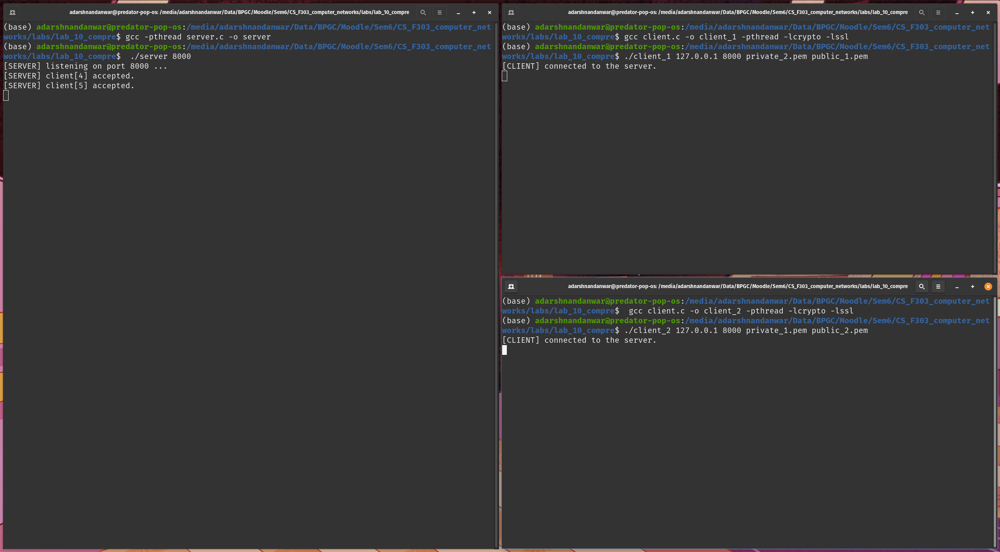
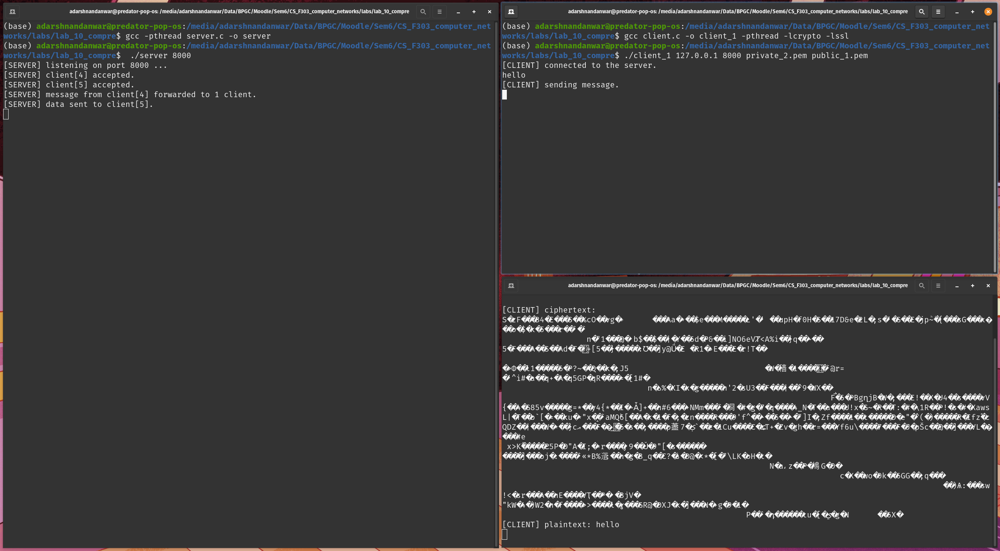
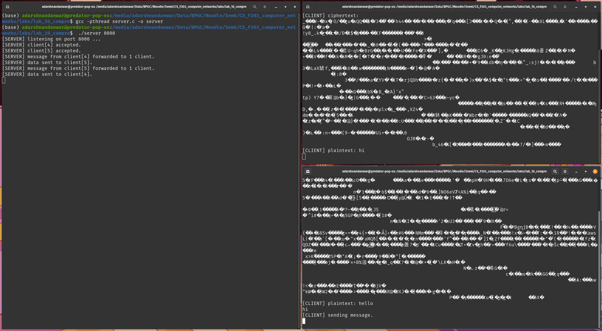
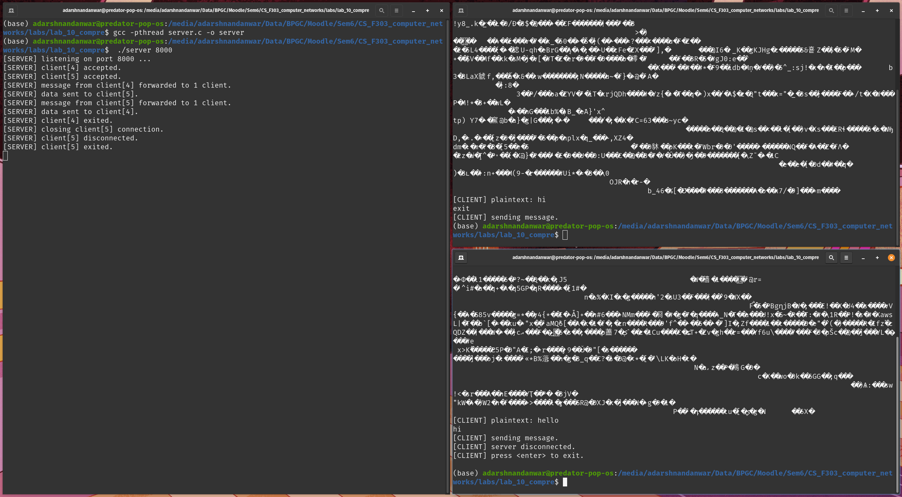

# Lab 10
<div style="font-size: 1.2rem">
Name- Adarsh Nandanwar<br>
BITS ID- 2018A7PS0396G</div>
<br>

# Two Client Communication Server with RSA Encryption in C
## Usage Instructions
1. Install OpenSSL library.
### Terminal 1 (Server)
2. Open a terminal window in the directory containing `server.c` file.
3. Compile the c program.
    ```bash
    $ # gcc -pthread <server_c_program> -o <server_executable_name>
    $ gcc -pthread server.c -o server
    ```
4. Run the server using the executable `server`. Parameters: {port_number}.
    ```bash
    $ # ./<server_executable_name> <port_number>
    $ ./server 8000
    ```
### Terminal 2 (Client 1)
5. Open a terminal window in the directory containing `client.c` file.
6. Compile the c program.
    ```bash
    $ # gcc <client_c_program> -o <client_1_executable_name> -pthread -lcrypto -lssl
    $ gcc client.c -o client_1 -pthread -lcrypto -lssl
    ```
7. Run the client 1 using the executable `client_1`. Parameters: {server_IP_address, port_number, private_key_file, public_key_file}.
    ```bash
    $ # ./<client_1_executable_name> <server_IP_address> <port_number> <private_key_file> <public_key_file>
    $ ./client_1 127.0.0.1 8000 private_2.pem public_1.pem
    ```
### Terminal 3 (Client 2)
8. Open a terminal window in the directory containing `client.c` file.
9. Compile the c program.
    ```bash
    $ # gcc <client_c_program> -o <client_2_executable_name> -pthread -lcrypto -lssl
    $ gcc client.c -o client_2 -pthread -lcrypto -lssl
    ```
10. Run the client 2 using the executable `client_2`. Parameters: {server_IP_address, port_number, private_key_file, public_key_file}.
    ```bash
    $ # ./<client_2_executable_name> <server_IP_address> <port_number> <private_key_file> <public_key_file>
    $ ./client_2 127.0.0.1 8000 private_1.pem public_2.pem
    ```
## Generating Keys
- The RSA keys were generated using:
    ```bash
    $ openssl genrsa -out private_1.pem 10000
    $ openssl genrsa -out private_2.pem 10000
    $ openssl rsa -in private_1.pem -pubout -out public_1.pem
    $ openssl rsa -in private_2.pem -pubout -out public_2.pem
    ```
- `RSA_PKCS1_PADDING` padding was used in the program. Using this, maximum input file size that can be encrypted using RSA is: 
    ```
    max_input_size (in bytes)
        = (key_size/8)-11 
        = (10000/8)-11 
        = 1239
    ```
## Sample Run



