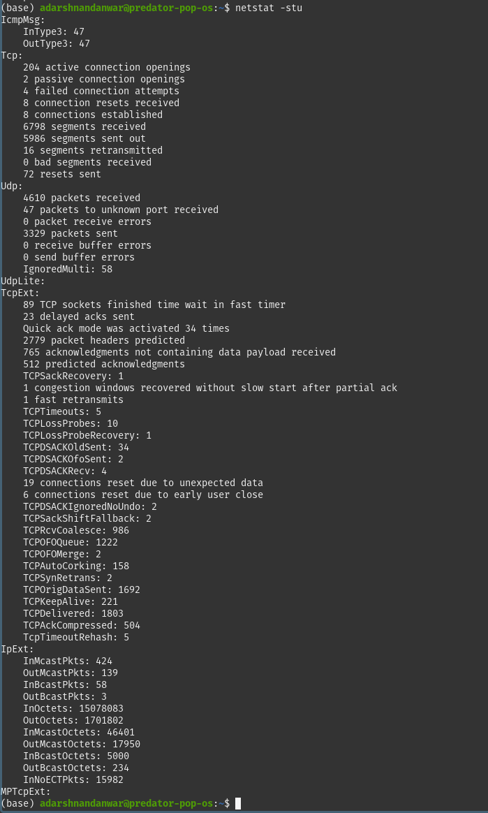
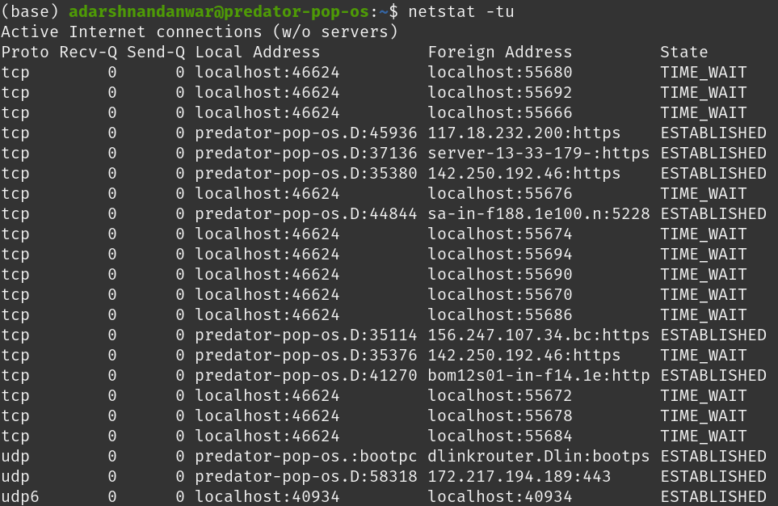
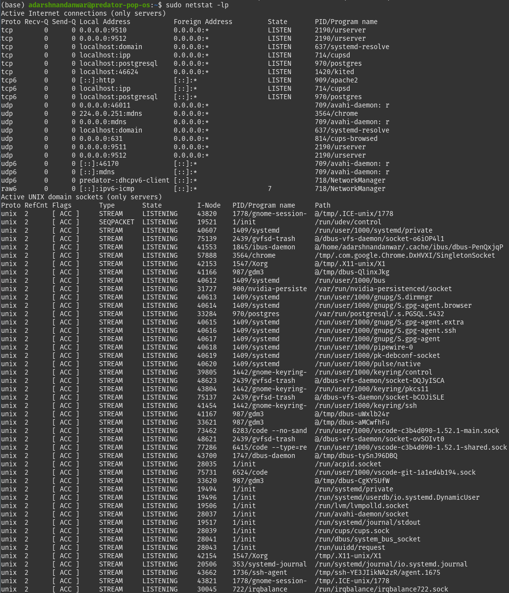
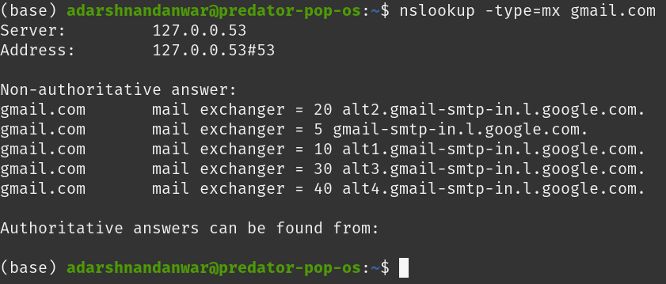
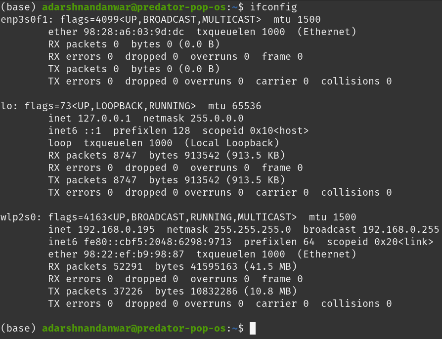
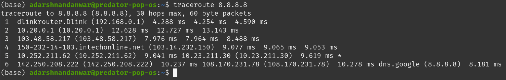
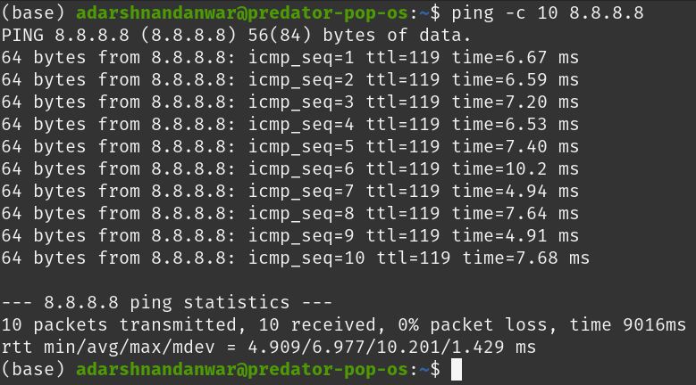
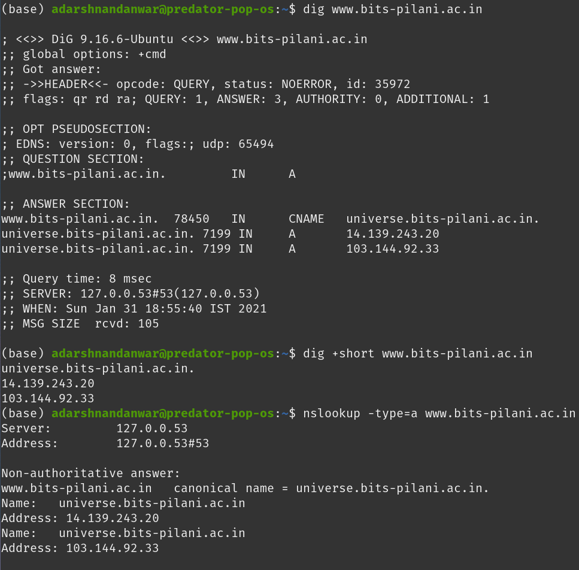

# Lab 2
<div style="font-size: 1.2rem">
Name- Adarsh Nandanwar<br>
BITS ID- 2018A7PS0396G</div>
<br>
<br>

1. See the statistics of TCP and UDP ports on Linux machine
    - `netstat` is used to print network connections, routing tables, interface statistics, masquerade connections, and multicast memberships
    - `-s`, `--statistics` - Display summary statistics for each protocol.
    - `-t`, `--tcp` - Show TCP ports. 
    - `-u`, `--udp` - Show UDP ports.
    ```shell
    $ netstat -stu
    $ netstat -tu
    ```
    
    
2. Enlist the listening ports on your machine
    - `netstat` is used to print network connections, routing tables, interface statistics, masquerade connections, and multicast memberships
    - `-l`, `--listening` - Show only listening sockets.  (These are omitted by default.) 
    - `-p`, `--program` - Show the PID and name of the program to which each socket belongs.
    ```shell
    $ netstat -lp
    ```
    
3. See the mail xchange (MX) record for www.gmail.com
    - `nslookup` is a program to query Internet domain name servers.
    - `type=mx` will output a list of mail exchange servers for that domain.
    ```shell
    $ nslookup -type=mx gmail.com
    ```
    
4. Display the all network interfaces on your machine
    - `ifconfig`  is used to configure the kernel-resident network interfaces.
    - If no arguments are given, ifconfig displays the status of the currently active interfaces.
    - In the screenshot, there are ethernet, loopback and wlan interfaces
    ```shell
    $ ifconfig
    ```
    
5. A list of intermediate routers to reach 8.8.8.8 from your machine, with latency
    - `traceroute` tracks the route packets taken from an IP network on their way to a given host. 
    ```shell
    $ traceroute 8.8.8.8
    ```
    
6. Send 10 echo requests to 8.8.8.8 server from your machine
    - `ping` uses the ICMP protocol's mandatory ECHO_REQUEST datagram to elicit an ICMP ECHO_RESPONSE from a host or gateway.
    - `-c` - count. Stop after sending "count" ECHO_REQUEST packets. With deadline option, ping waits for count ECHO_REPLY packets, until the timeout expires.
    ```shell
    $ ping -c 10 8.8.8.8
    ```
    
7. Get the IP address of www.bits-pilani.ac.in domain.
    - There are many ways to get this
        - `dig` - It is command for DNS lookup utility. We can use `+short` to get only the ip address
        - `nslookup` - It is a program to query Internet domain name servers. `-type=a` is optional as it is the default type.
    ```shell
    $ dig www.bits-pilani.ac.in
    $ dig +short www.bits-pilani.ac.in
    $ nslookup -type=a www.bits-pilani.ac.in
    ```
    