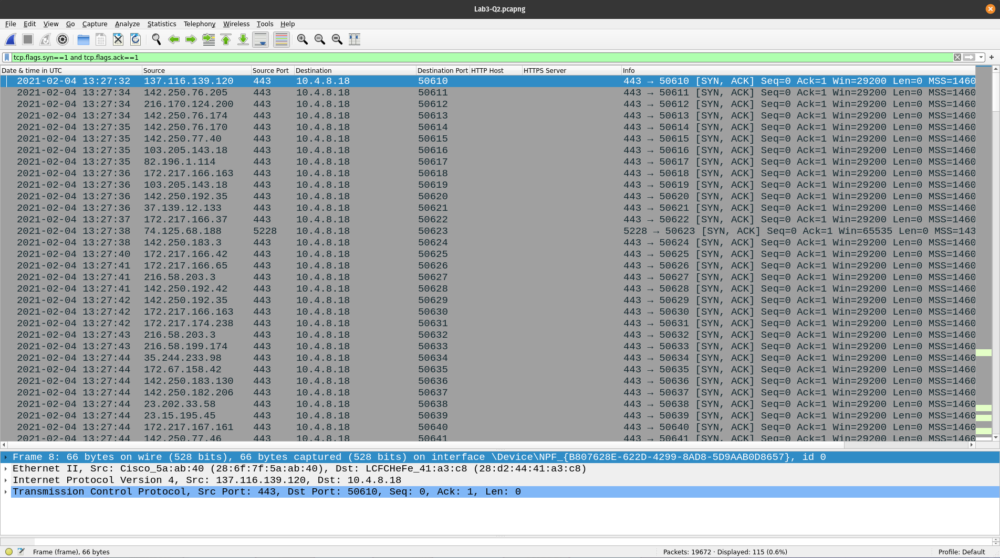

# Lab 3
<div style="font-size: 1.2rem">
Name- Adarsh Nandanwar<br>
BITS ID- 2018A7PS0396G</div>
<br>
<br>

## 1. Customizing Wireshark
Columns:
- Date & time in UTC
- Source IP and source port
- Destination IP and destination port
- HTTP host
- HTTPS server
- Info


## 2. Wireshark Dump Analysis
### a. Identify the http request packet
```
http.request
``` 
- `http.request` filter is of boolean type. It displays the packet if it is a http request packet.

### b. Identify the http response packet
```
http.response
``` 
- `http.response` filter is of boolean type. It displays the packet if it is a http response packet.

### c. Display the statistics of the TCP and UDP packets
```
tcp or udp
``` 
- `tcp` filter is used to display only the packets containing the TCP protocol.
- `udp` filter is used to display only the packets containing the UDP protocol.
- `or` is the logical or operator. This displays the packets satisfying either of the two conditions.

### d. List out the TCP packets whose syn. and ack. Flags are on.
```
tcp.flags.syn==1 and tcp.flags.ack==1
``` 
- `tcp.flags` contains all the flags related to the protocol.
- `tcp.flags.syn` is synchronization flag. It is used in first step of connection establishment phase or 3-way handshake process between the two hosts. Only the first packet from sender as well as receiver should have this flag set.
- `tcp.flags.ack` is acknowledgement flag. It is used to acknowledge packets which are successfully received by the host.
- `and` is the logical and operator. This displays the packets satisfying both conditions.

### e. List out the TCP and UDP packets where destination port=80.
```
tcp.dstport == 80 || udp.dstport == 80
``` 
- `.dstport` is used to get the destination port of the packet.
- `==` logical operator is used to compare values.

### f. List out the ARP packets.
```
arp
``` 
- ARP is used to dynamically build and maintain a mapping database between link local layer 2 addresses and layer 3 addresses. In the common case this table is for mapping Ethernet to IP addresses. This database is called the ARP_Table. 
- Dynamic entries in this table are often cached with a timeout of up to 15 minutes, which means that once a host has ARPed for an IP address it will remember this for the next 15 minutes before it gets time to ARP for that address again.
- `arp` filter is used to show only the ARP based traffic:
