# Lab 4

Name- Adarsh Nandanwar 
BITS ID- 2018A7PS0396G

 
 

## Screenshots
- Compiling `server.c` and `client.c`
    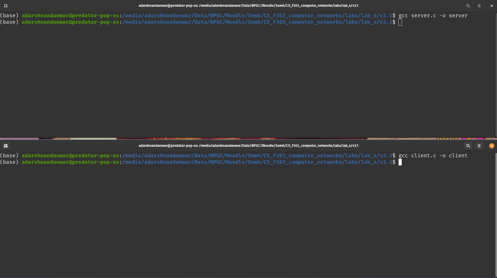
- Executing server
    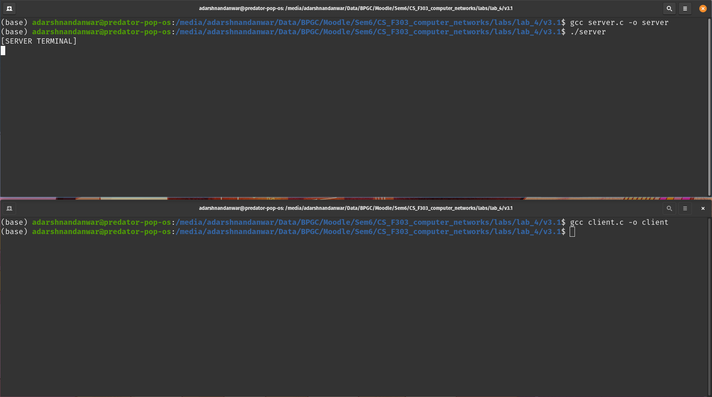
- Executing client. Connection established.
    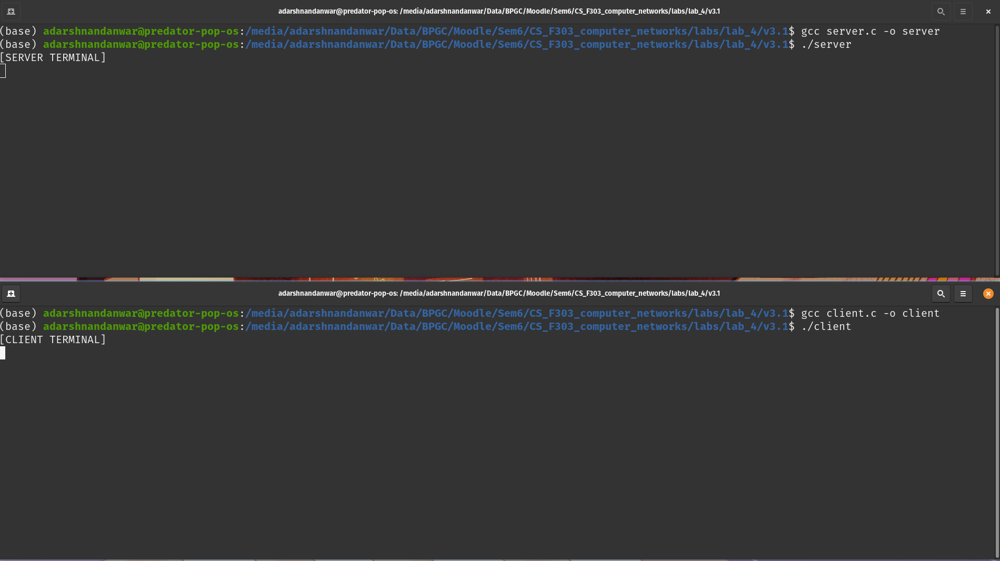
- Writing message in client terminal
    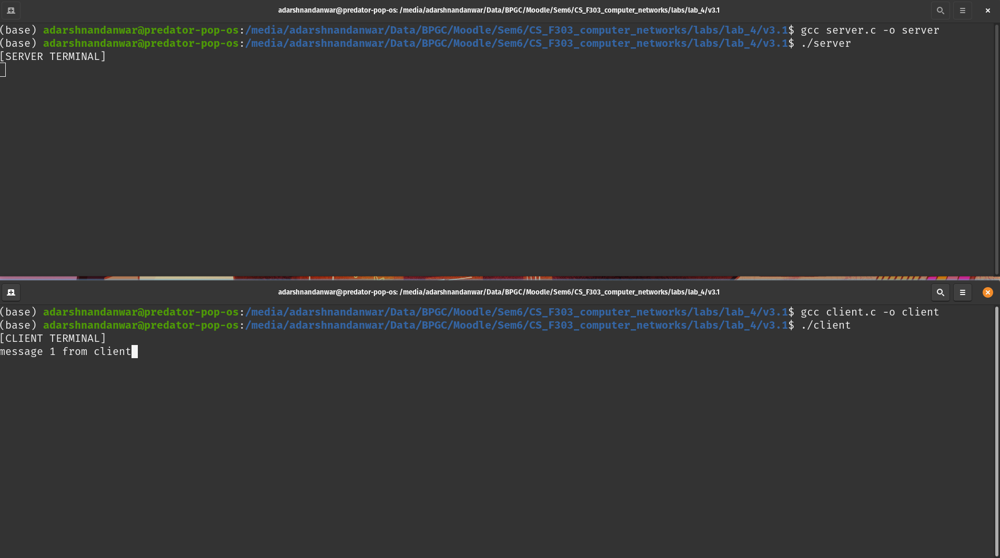
- Sending message from client to server
    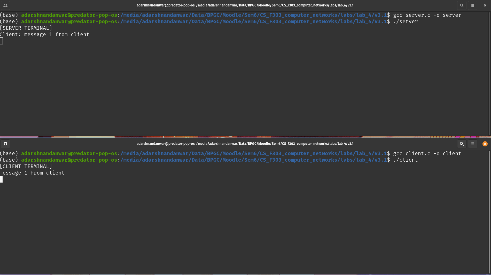
- Writing message in server terminal
    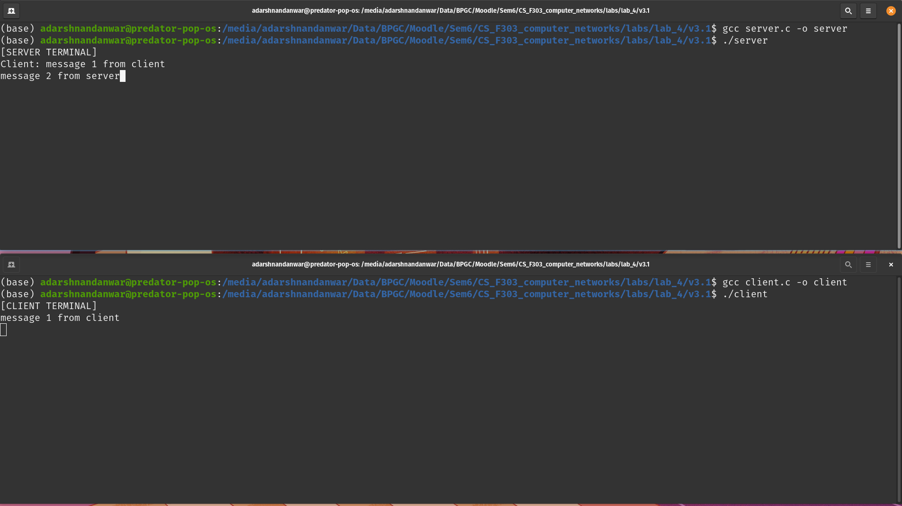
- Sending message from server to client
    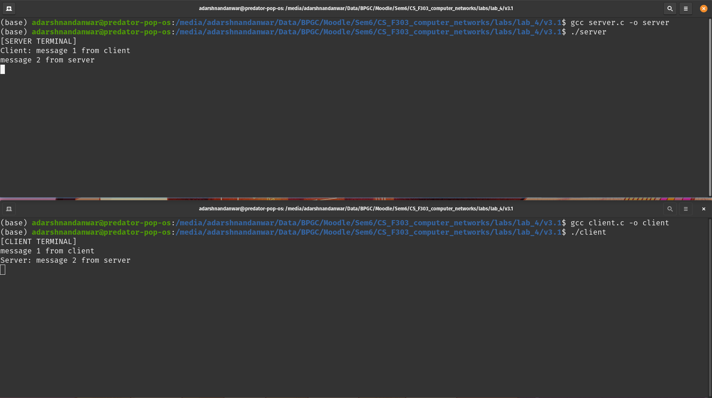
- Sending multiple messages between client and server
    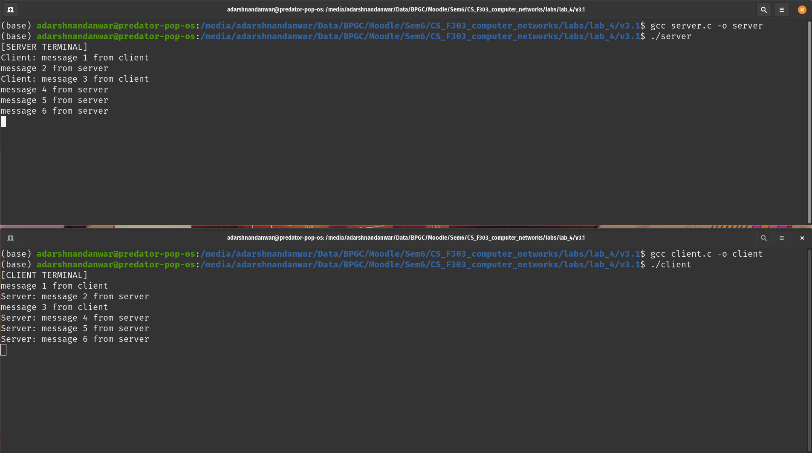
- Writing `exit` in client
    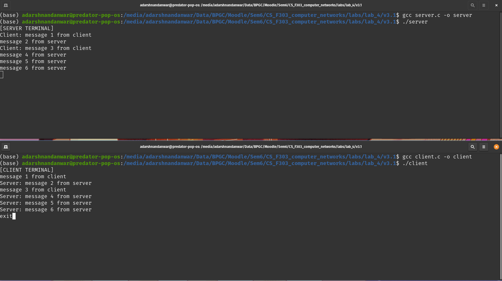
- Exiting from client when server is running
    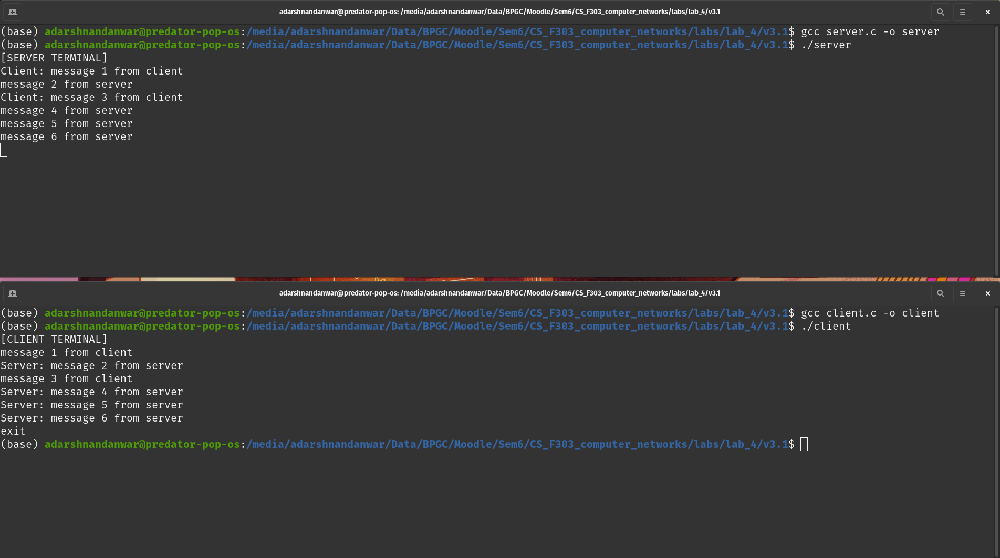
- Exiting from server when client is running
    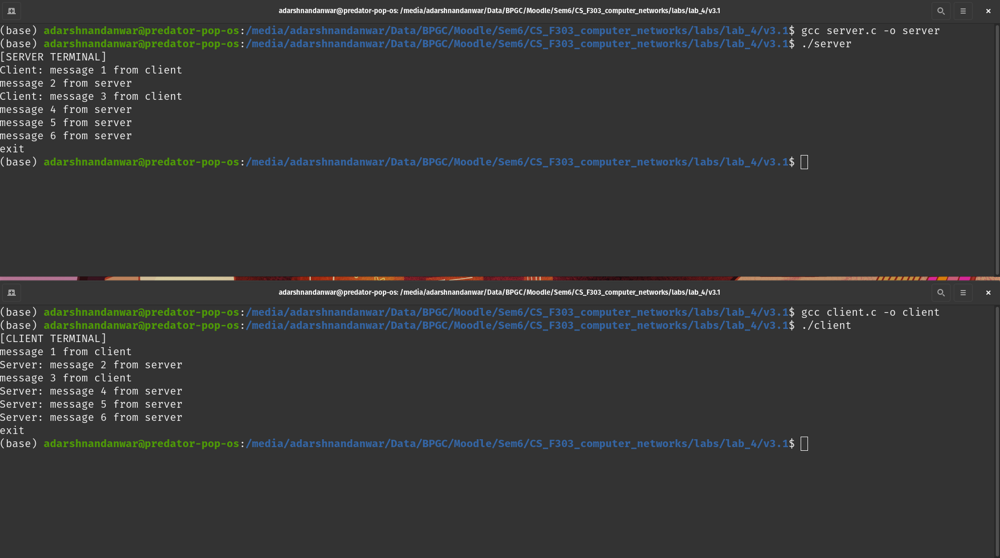