# Lab 5

Name- Adarsh Nandanwar 
BITS ID- 2018A7PS0396G

 
 

## Screenshots
1. Navigating to the directories of server and client
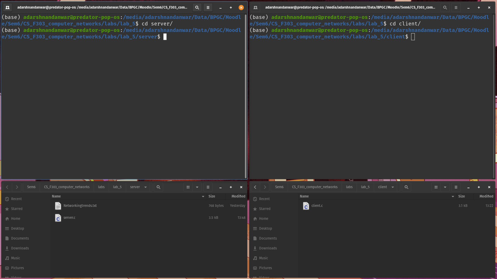
2. Compiling the server and client C programs.
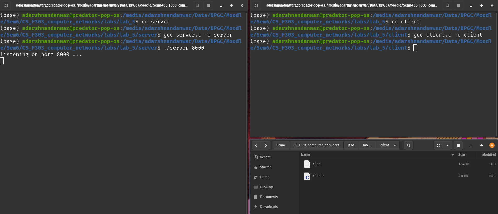
3. Running the server
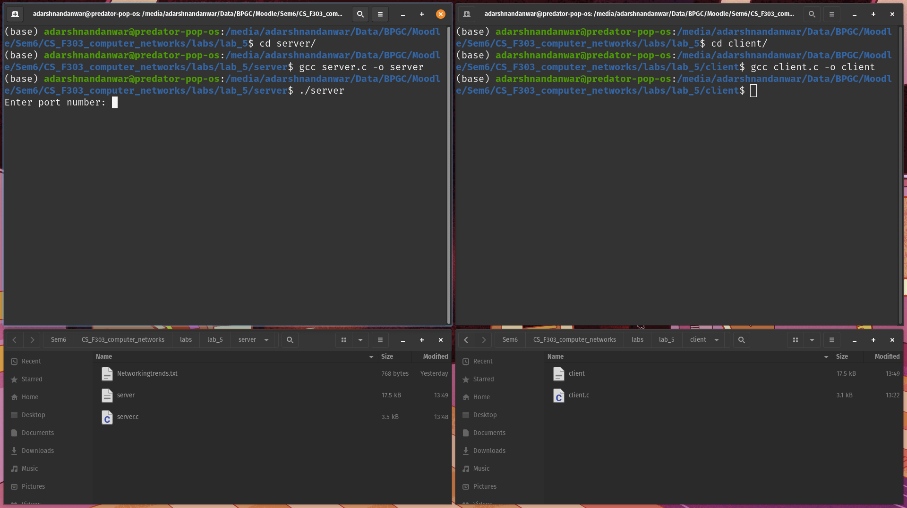
4. Entering the port number in server.
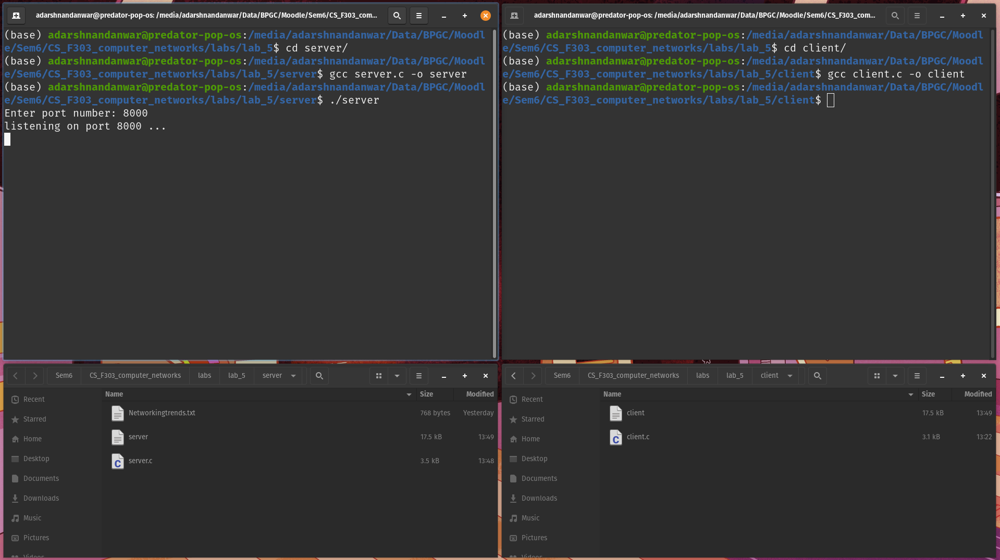
5. Running the client. 
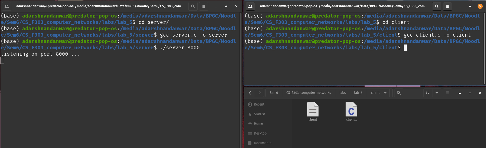
6. Entering the server's IP address in client.
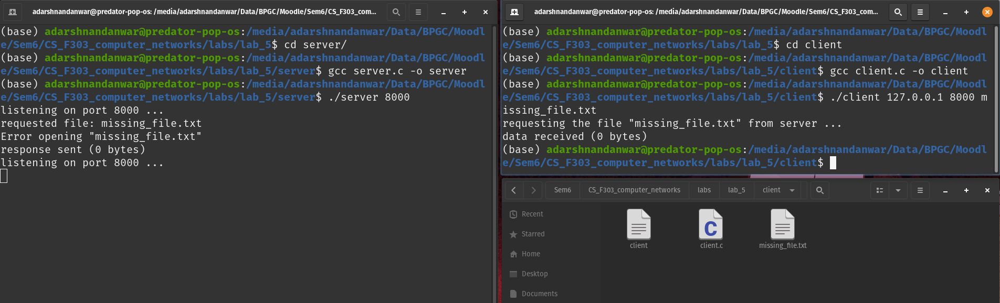
7. Entering the port number in client.
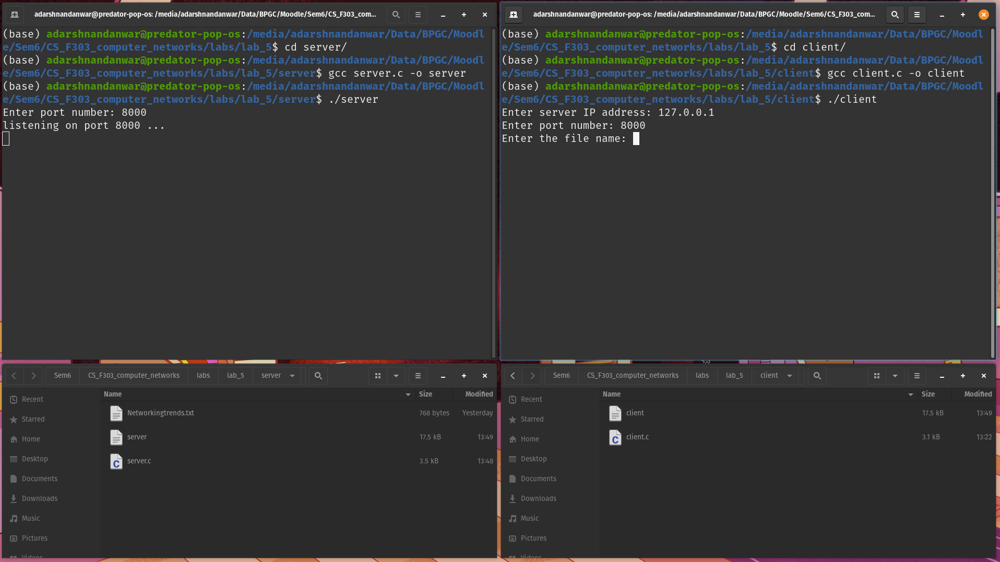
8. Requesting existing file. Received data stored in a file in client directory.
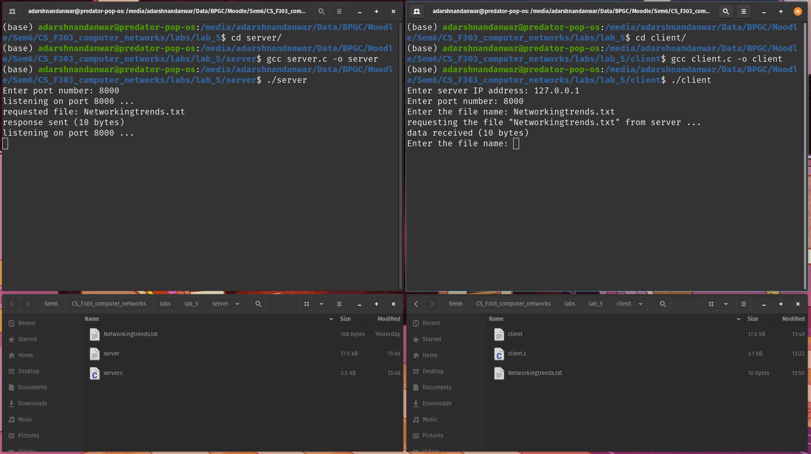
9. Requesting missing file. Empty file stored in client directory.
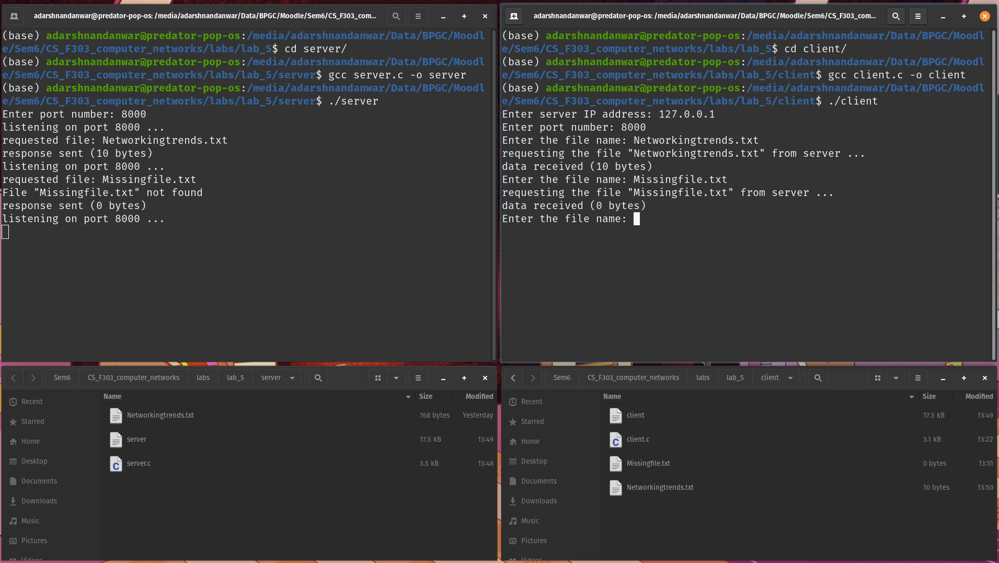
10. Exiting the server process.
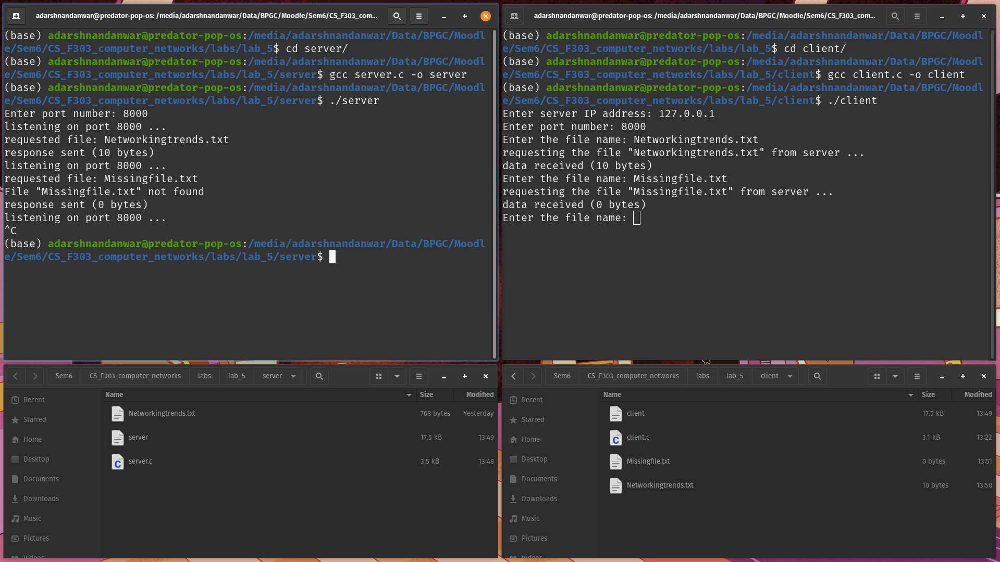
11. Requesting file when server is unreachable.
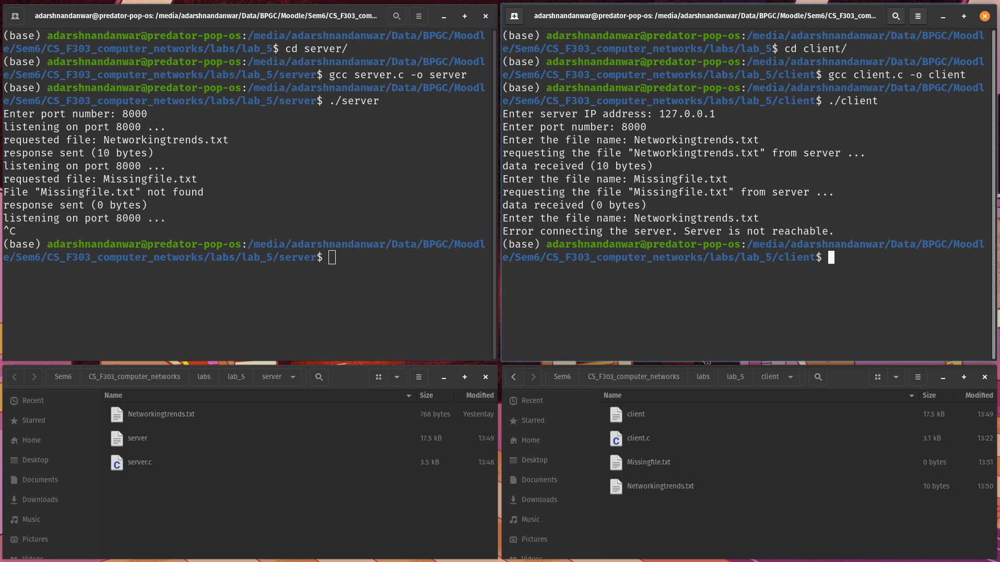