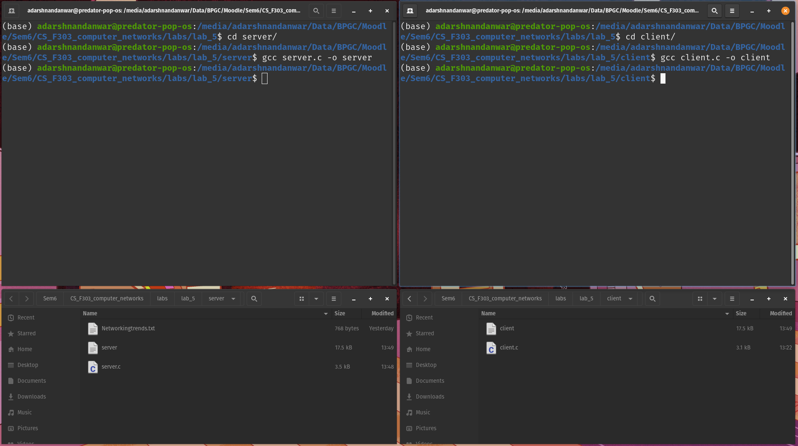
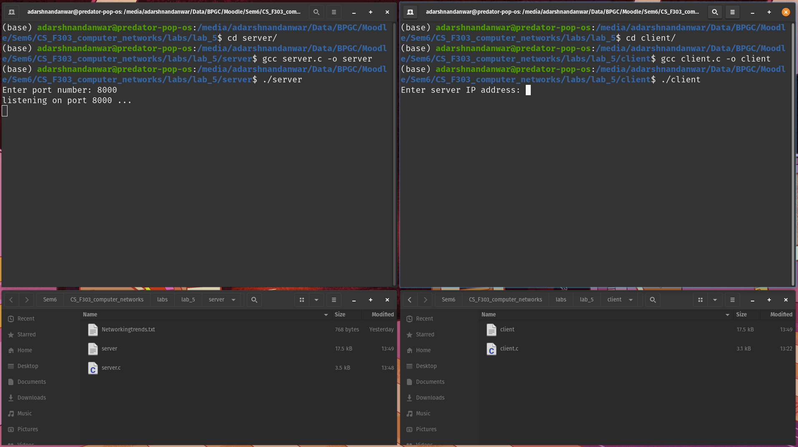
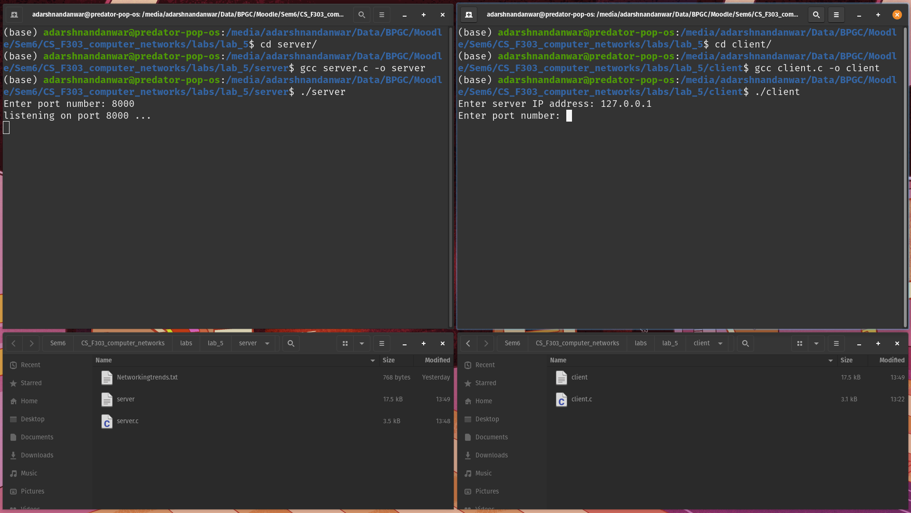

# Lab 5

Name- Adarsh Nandanwar 
BITS ID- 2018A7PS0396G

 
 

## Screenshots
1. Navigating to the directories of server and client and compiling their respective C programs.

2. Running the server on port 8000.

3. Running the client. Received data stored in the file.

4. Running client when server is unreachable.

5. Before requesting missing file

6. After requesting missing file
