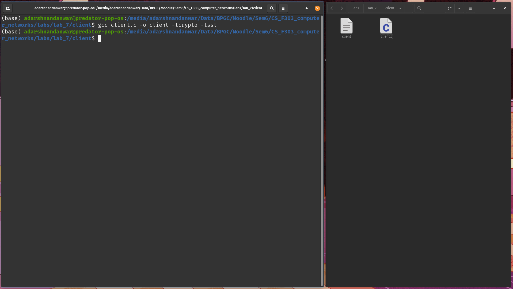
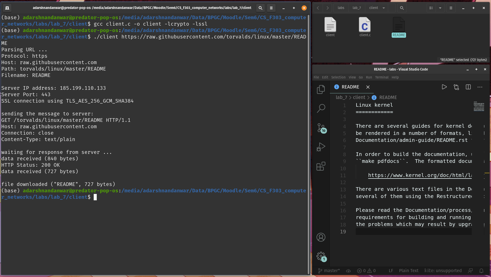
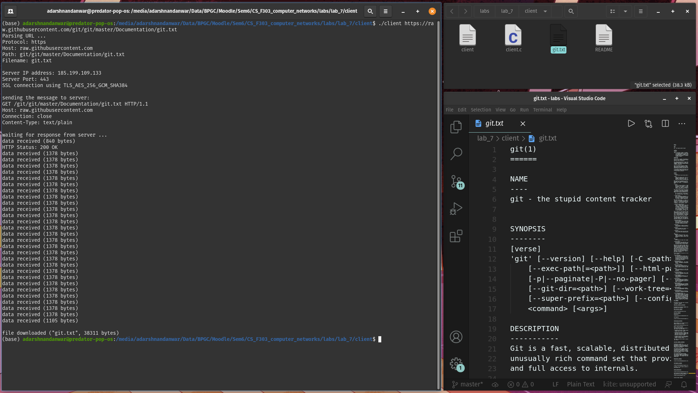
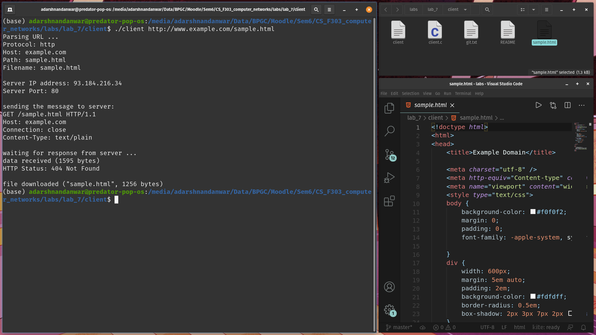
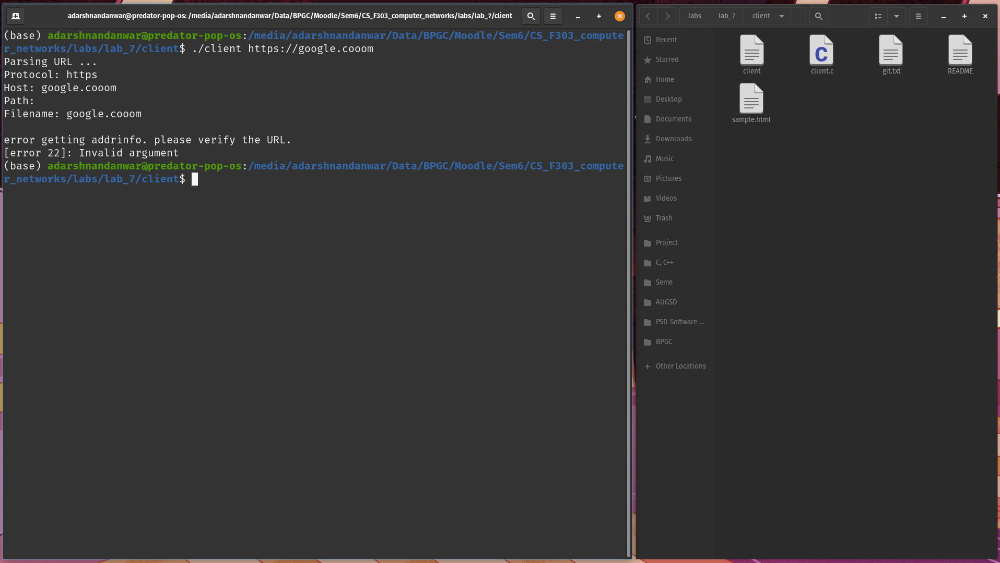

# Lab 7

Name- Adarsh Nandanwar 
BITS ID- 2018A7PS0396G

 
 

## Program Screenshots
1. Open a terminal window in the directory containing `client.c` file.

2. Compile the `client.c` file with `-lcrypto` and `-lssl`.

3. Run client with {file_url} as arguement. Here file_url is "https://raw.githubusercontent.com/torvalds/linux/master/README". The file is downloaded in the present working directory.

4. Run client with {file_url} as arguement. Here file_url is "https://raw.githubusercontent.com/git/git/master/Documentation/git.txt". The file is downloaded in the present working directory.

5. Run client with {file_url} as arguement. Here file_url is "http://www.example.com/sample.html". The file is downloaded in the present working directory.

6. Run client with {file_url} as arguement. Here file_url is "http://google.cooom". This does not exist or is unreachable. Error is displayed.

### References:
https://stackoverflow.com/questions/41229601/openssl-in-c-socket-connection-https-client