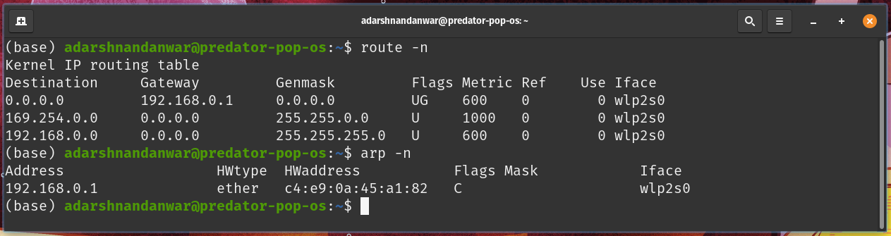

# Lab 8
<div style="font-size: 1.2rem">
Name- Adarsh Nandanwar<br>
BITS ID- 2018A7PS0396G</div>
<br>
<br>

## Customizing Wireshark

Columns:
- No. (Hidden)
- Date & time in UTC
- Source IP
- Source port
- Destination IP
- Destination port
- Protocol
- Packet Length
- IP Length `ip.len`
- IP Header Length `ip.hdr_len`
- TCP Length `tcp.len`
- TCP Header Length `tcp.hdr_len`
- TCP Bytes in Flight `tcp.analysis.bytes_in_flight` - Tells bytes that are sent but not ACKed
- HTTP host (Hidden) `http.host`
- HTTPS server (Hidden) `tls.handshake.extensions_server_name`
- Info
### Column Preferences

## Program Screenshots
### Capturing Packets
- Start the wireshark capture
    
- To see DHCP in action, we must release the current IP address and obtain a new one. Use the following commands in the terminal
    ```bash
    $ sudo dhclient -r
    $ sudo dhclient
    ```
    
    
- To view the ARP table, use the following terminal commands:
    ```bash
    arp -a
    arp
    ```
    
- To flush the ARP table, use:
    ```bash
    $ sudo ip -s -s neigh flush all
    ```
    
- The ARP table is now empty.
    
- Pinging [google.com](google.com) to create the ARP table entry for the gateway router.
    
- The ARP table now has the entry for the gateway router.
    
- Stop the wireshark packet capture.
    

### DHCP Protocol
- Dynamic Host Configuration Protocol (DHCP) is a client/server protocol that automatically provides an Internet Protocol (IP) host with its IP address and other related configuration information such as the subnet mask and gateway router.
- To see all the dhcp communication, use the following filter in wireshark
    ```
    dhcp
    ```
    
- Packets from client to server port uses port `67` (server port)
    ```
    dhcp and udp.dstport == 67
    ```
    
- Packets from server to client port uses port `68` (client port)
    ```
    dhcp and udp.dstport == 68
    ```
    
- DHCP is a 4 step protocol:
    1. **DCHP Discover** (request) - whenever a device enters the network, it will not have IP address (source IP = `0.0.0.0`). So, it will ask if there is a DHCP server by broadcasting (destination IP = `255.255.255.255`)
    
    We can see that the destination address is broadcast, source IP address is `0.0.0.0`, source port is `68` and the destination port is `67`. DHCP uses UDP protocol.
    2. **DHCP Offer** (reply) - On receiving the discovery, DHCP offers one of the available IP address to the client.
    
    We can see that the  source port is `67` and the destination port is `68`. The IP address of the DHCP server is `192.168.0.1`.
    3. **DHCP Request** - Client confirms the offer that DHCP made and requests to accept the proposed IP address.
    
    4. **DHCP ACK** (acknowledgment) - DHCP server acknowledges the client and allocates the IP to the new device.
    
    The IP address alloted to the new client is `192.168.0.195`
### ARP Protocol
- Address Resolution Protocol (ARP) is a procedure for mapping a dynamic Internet Protocol address (IP address) to a permanent physical machine address in a local area network (LAN).
- Wireshark filter to see the ARP packets is
    ```
    arp
    ```
    
- Now the ARP table is empty. When the client needs to access the internet, it will need MAC address of the gateway router. So it will make an ARP request
- The ARP process consists of:
    - **ARP request** - The client broadcasts in the network and asks for the MAC address of the given IP address and asks to tell it to the client. As we can see, the client IP is the source, the destination is broadcast and the Target IP contains the IP for which the client wants to know the MAC address. To filter ARP requests, use:
        ```
        arp and arp.opcode == 1
        ```
        
    - **ARP reply** - Only the host with the matching IP address will reply with its MAC address and others will ignore. Source is the host with the requested IP address (which is in this case the gateway router) and the destination is the host who requested the MAC address (client IP address = `192.168.0.195`)
        ```
        arp and arp.opcode == 2
        ```
        
    The MAC address of the replier (IP address = `192.168.0.1`) is highlighted in the screenshot which is `c4:e9:0a:45:a1:82`
### MAC Address of Gateway Router
- To get the MAC address and the IP address of the gateway router, use the same filter `arp` or `arp and arp.opcode == 2` in wireshark to get an ARP reply packet.
    
- The MAC address and the IP address of the gateway router is highlighted in the screenshot. 
    - MAC Address of gateway router = `c4:e9:0a:45:a1:82`
    - IP Address of gateway router = `192.168.0.1`
- MAC address and IP address of the gateway router can also be found using terminal commands:
    