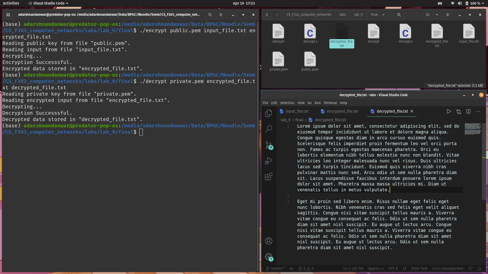

# Lab 9

Name- Adarsh Nandanwar 
BITS ID- 2018A7PS0396G

 
 

## Program Screenshots
1. Open a terminal window in the directory containing `input_file.txt`, `encrypt.c` and `decrypt.c` file.

2. Generate the private key.

3. Generate the public key.

4. Compile the c program `encrypt.c`.

5. Compile the c program `decrypt.c`.

6. Add content to `input_file.txt`.

7. Encrypt the file using the executable `encrypt`. Parameters: {public_key, input_file_name, output_file_name}

8. Decrypt the encrypted file using the executable `decrypt`. Parameters: {private_key, input_file_name, output_file_name}

5. The decrypted file is now saved in the present working directory.