# Midsem Lab
<div style="font-size: 1.2rem">
Name- Adarsh Nandanwar<br>
BITS ID- 2018A7PS0396G</div>
<br>
<br>

## Customizing Wireshark
Columns:
- No. (Hidden)
- Date & time in UTC
- Source IP
- Source port
- Destination IP
- Destination port
- Protocol
- Packet Length
- IP Length `ip.len`
- IP Header Length `ip.hdr_len`
- TCP Length `tcp.len`
- TCP Header Length `tcp.hdr_len`
- TCP Bytes in Flight `tcp.analysis.bytes_in_flight` - Tells bytes that are sent but not ACKed
- HTTP host (Hidden) `http.host`
- HTTPS server (Hidden) `tls.handshake.extensions_server_name`
- Info
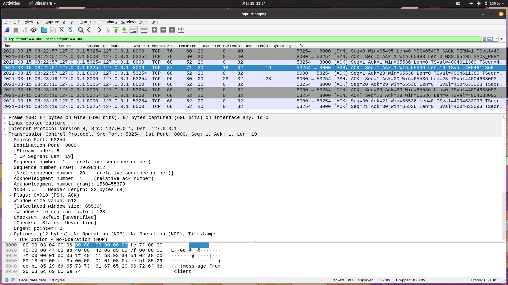
### Column Preferences
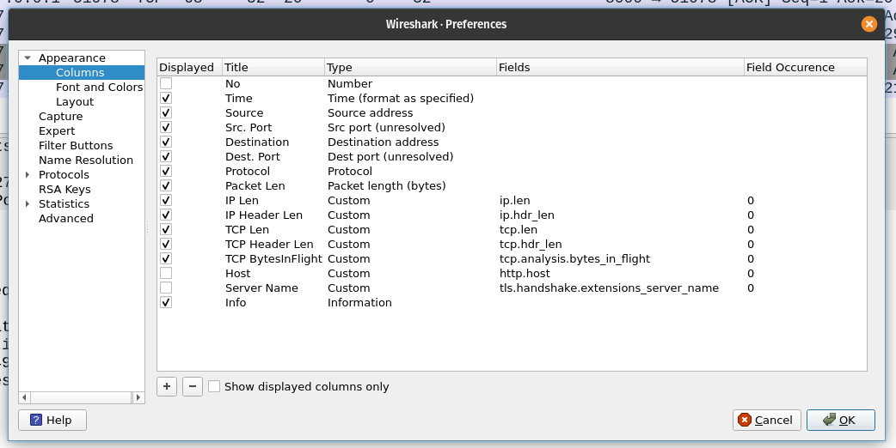

## Program Screenshots
1. Open wireshark and 2 terminals. Change the working directory of the terminals to the directory containing the `server.c` and `client.c` files.
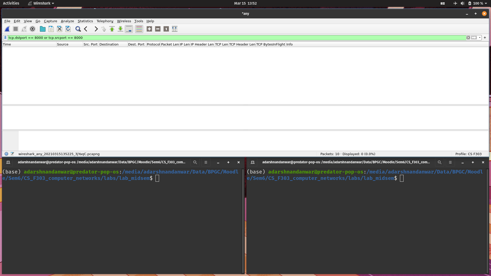
2. Start the wireshark packet capture
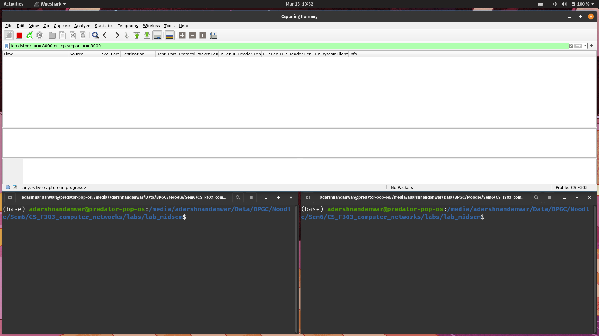
3. Compiling the `server.c` and `client.c` programs.
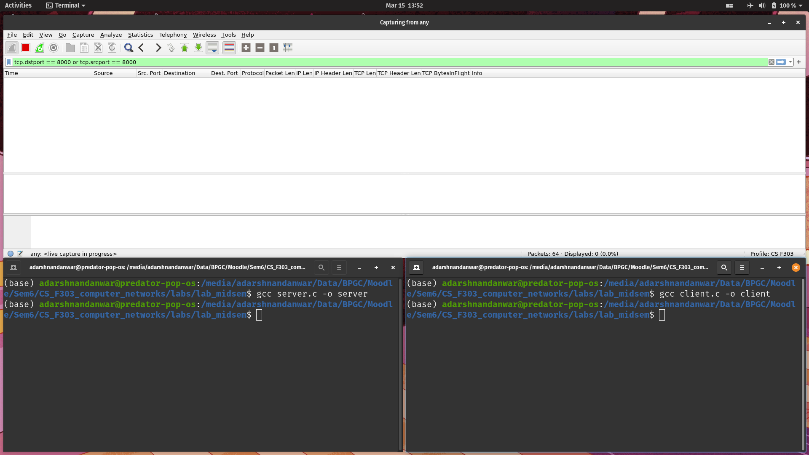
4. Run the server with {port_number} as arguement.
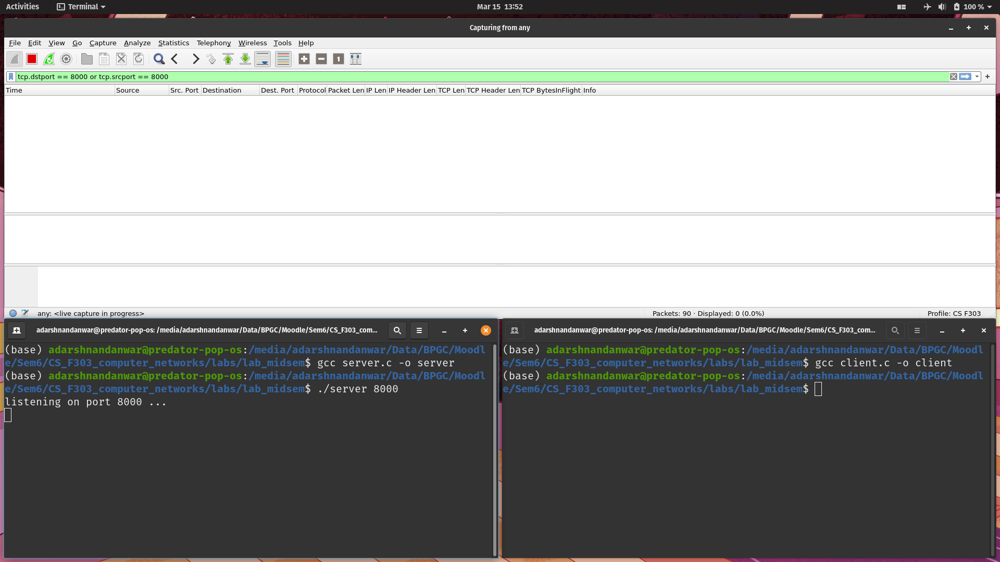
5. Run the client with {server_ip_address, port_number} as arguements.
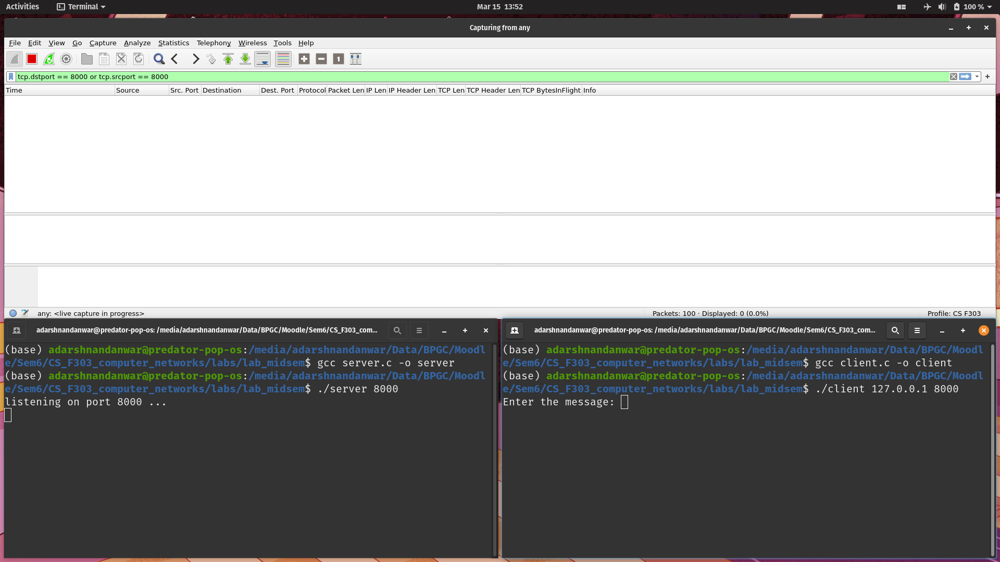
6. Type the message to be sent to the server in the client terminal.

7. Press enter to send the message. The reverse message is printed in the server terminal. The message can be seen in the wireshark packet data.
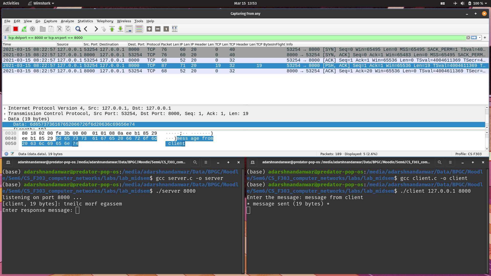
8. Type the response message to be sent to the client in the server terminal.
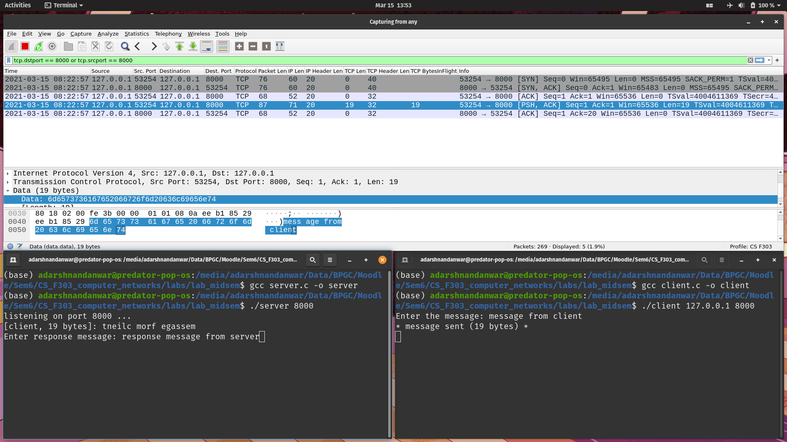
9. Press enter to send the message. The reverse message is printed in the client terminal. The message can be seen in the wireshark packet data.
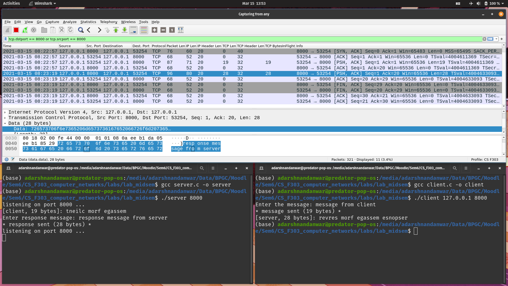
10. To exit the server, press ctrl+c.
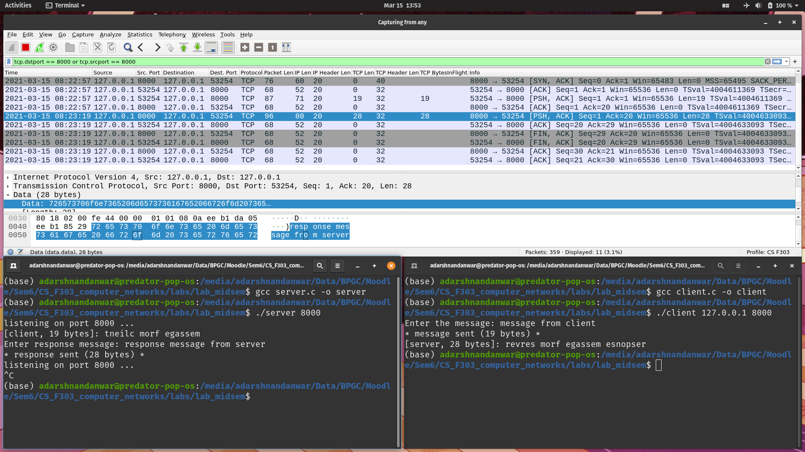
11. Stop the wireshark packet capture.
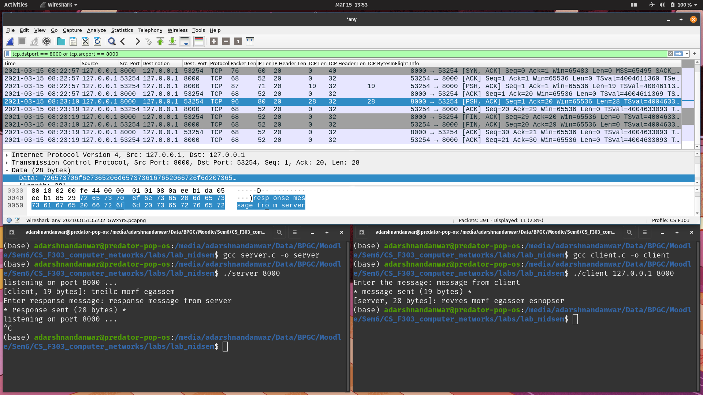

## Wireshark Capture Analysis
### Capturing the packets between the client and server
#### All packets going in and out of the server
```
ip.addr == 127.0.0.1 and (tcp.dstport == 8000 or tcp.srcport == 8000)
```
- `ip.addr` is used get packet's IP address
- `.dstport` is used to get the destination port of the packet.
- `.srcport` is used to get the source port of the packet.
- `==` logical operator is used to compare values.
- Using the above filter, we can capture all the tcp packets going in and out of the server port (8000).
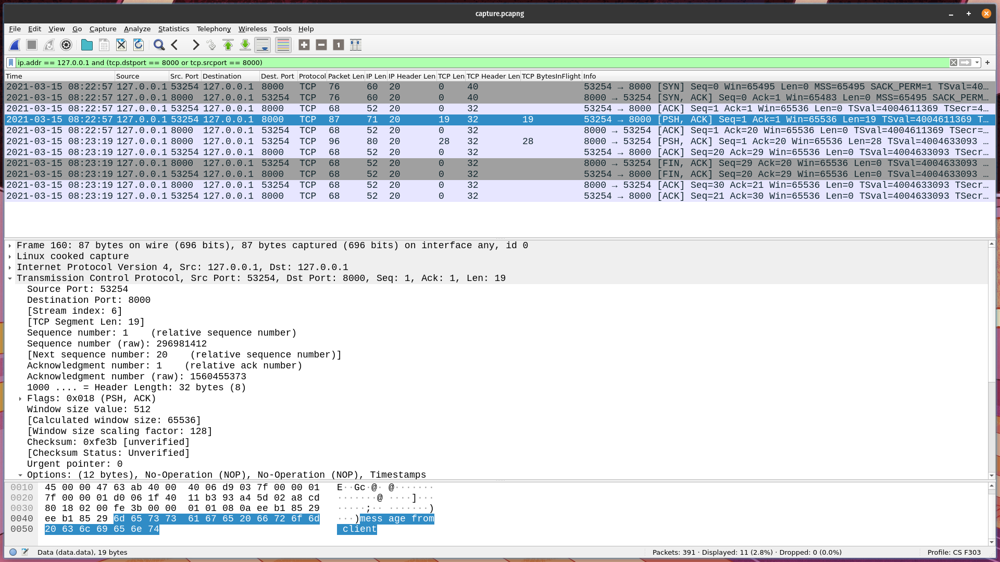
#### Packets sent to the server
```
ip.addr == 127.0.0.1 and tcp.dstport == 8000
```
- Using the above filter, we can capture all the tcp packets whose destination is the server port (8000).
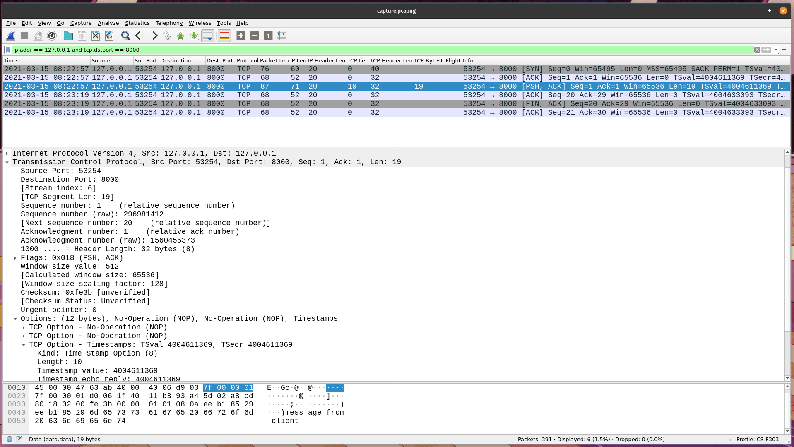
#### Packet sent to the server containing data
```
ip.addr == 127.0.0.1 and tcp.dstport == 8000 and tcp.len>0
```
- Using the above filter, we can capture all the tcp packets whose destination is the server port (8000).
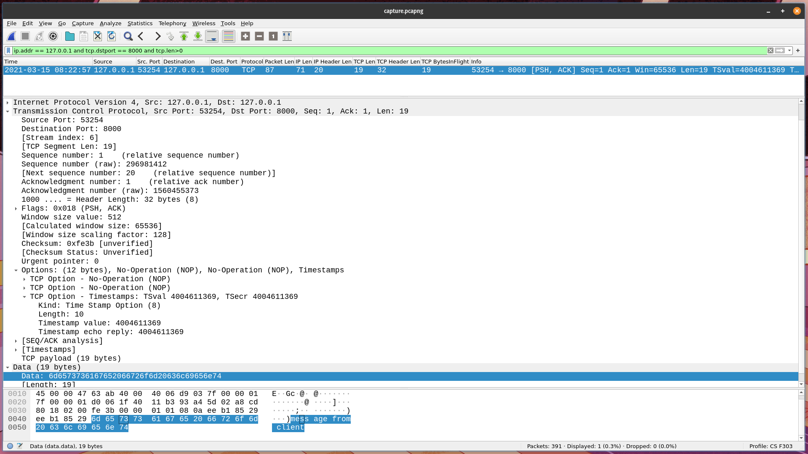
### Size Comparision
- IP Length includes the IP Header, TCP Header and the application data.
    ````
    ip.len = ip.hdr_len + tcp.hdr_len + tcp.len
    ````
- The custom columns  added are described in the section [Customizing Wireshark](##Customizing\ Wireshark)
#### Client to Server
- In the packet sent from the client to the server containing the data, the frame size is 87 (column "Packet Len") bytes. The frame header takes 16 bytes.
- The remaining 87-16 = 71 bytes is the IP length (column "IP Len" `ip.len`). The IP header length is 20 bytes (column "IP Header Len" `ip.hdr_len`) and the TCP header length is 32 bytes (column "TCP Header Len" `tcp.hdr_len`). The TCP segment length or the payload length is given by the above formula = 71-20-32 = 19 bytes. This value can be seen highlighted in the screenshot:
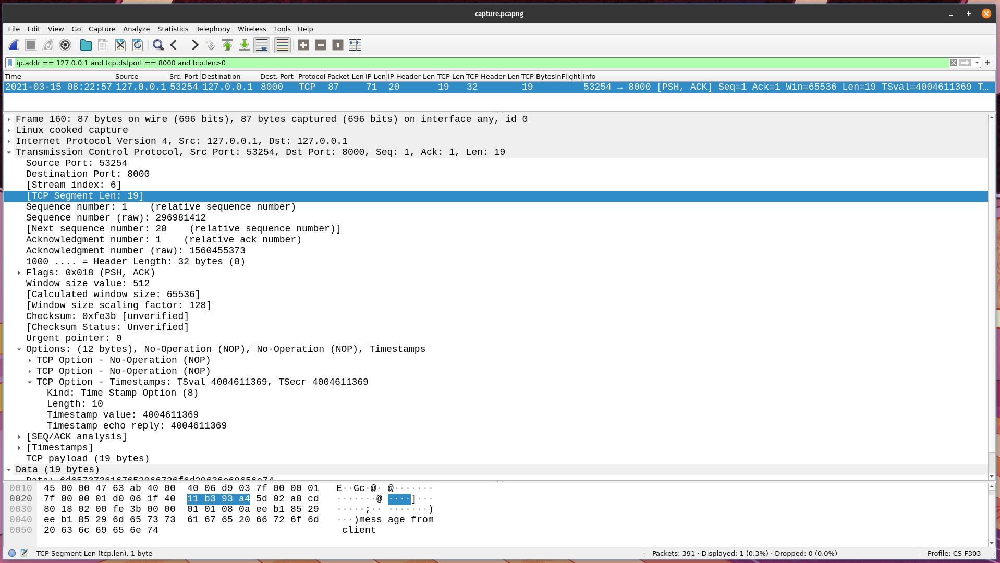
- This value matches with the value `tcp.len` given in the "TCP Len" column.
- This value also matches with the number of bytes sent by the client and the number of bytes received by the server which is printed in `STDOUT` in their respective terminals.

- The data is stored in byte number 68 to 86 of the packet which can be seen in the byte view of the wireshark window.


<!-- 

#### Server to Client
- In the response message packet from the server to the client, the IP length is 80 bytes, IP header length is 20 bytes and the TCP header length is 32 bytes. The TCP length or the payload length is given by the above formula = 80-20-32 = 28 bytes.
- This value matches with the value `tcp.len` given in the `TCP Len` column.
- This value also matches with the number of bytes sent by the server and the number of bytes received by the client which is printed in STDOUT in their respective terminals.
- The data is stored in byte number 68 to 95
### Explaination
#### Definitions
- There are multiple flags in a TCP packet.
    - `[SYN]` - This flag is used to initiate a TCP connection by synchronizing the sequence numbers.
    - `[FIN]` - This flag is used to indicate that the data transfer has ended and closes the TCP connection.
    - `[ACK]` - This flag is used to acknowledge that the packet was received successfully
    - `[PSH]` - Tells the receiver that the data should be immediately pushed to the receiving application.
#### Output

- The first 3 packets are used for the 3 way TCP handshake to establish the connection.
    1. `[SYN]` The client sends the packet containing the initial sequence number (for one direction) to establish a connection with the server.
    2. `[SYN, ACK]` The server acknowledges that it has received the packet and also sends its initial sequence number (for the other direction). 
    3. `[ACK]` The client acknowledges that the server's response and the TCP 3 way handshake is complete.
- Next 2 packets are used to send message from client to server which was taken from STDIN of client

    4. `[PSH, ACK]` Client sends a packet containing the message to the server.
    5. `[ACK]` The server acknowledges that the packet containing the message from the client has been received. 
- Next 2 packets are used to send the response message from server to client which was taken from STDIN of server

    6. `[PSH, ACK]` The server sends a message containing the response message to the client.
    7. `[ACK]` The client acknowledges that the packet containing the message from the server has been received. 
- The last 3 packets are used to close the TCP connection.
    
    8. `[FIN, ACK]` - the server informs the client that it wants to close the connection ans also acks the last message received
    9. `[FIN, ACK]` - the client acknowledges the connection close message and closes the connection
    10. `[ACK]` - the server receives the confirmation form the client and closes the connection. It sends the acknowledgement to the client. -->